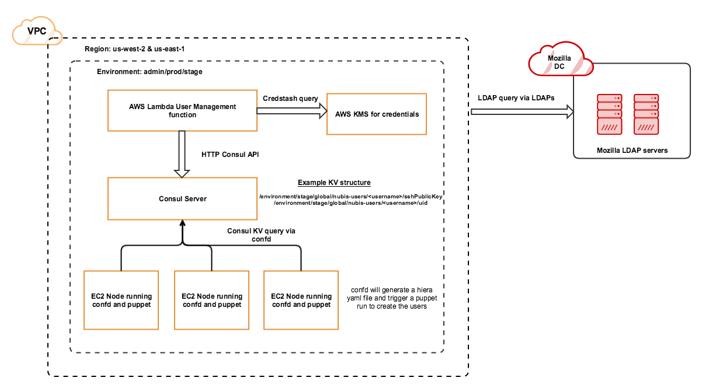
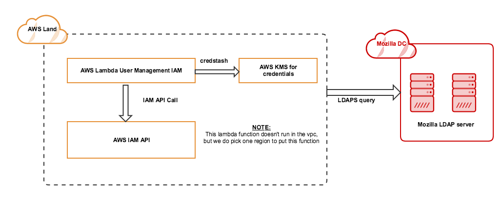

## nubis-bastionsshkey
This script has 2 functions they consist of an IAM portion and a consul portion. It will query LDAP and create consul KV entries as well as IAM users based on the LDAP group you are in.

### Design
Although able to run through the command line once built, this script can also run on a lambda function which is how we plan on running this. The lambda function will run a nodejs file that will call
the built go binary from within the lambda function. Once you run it, it will use unicreds to query a DynamoDB table that has the encrypted config file that it needs, at this point if you are trying
to write information to a consul KV store it will query LDAP and insert the relevant information into the consul cluster. As for IAM it will create an IAM user and send you a GPG encrypted email that
contains your AWS Access Key and AWS Secret Key

Its worth noting that we create IAM users and place them in certain IAM paths based on your LDAP group, based on those path we also know what IAM roles to give you, at this moment we only really have
2 roles which is an Admin role and a Readonly role. If you are listed as an IAM admin you will be given 2 roles an admin role and a readonly role, everybody else who is not an admin will only get a 
readonly role.

#### User management consul


Once the data is inserted into the consul KV store, there is a process on each EC2 instance that will generate a hiera yaml file. After each generation we make a puppet call to create Unix users 
on each EC2 node, we ensure that users are removed by ensuring that puppet manages the user resource using `resource { 'user': purge => true }`.

Below is an example of the yaml file that confd will generate
    ```yaml
    ---
        username:
            groups:
                - wheel
                - users
            ssh_keys: |
                ssh-rsa akjshdlaksjdlaskjdaslkdjasldkjasd
    ```

#### User management IAM

### Requirements
1. Make sure `GOPATH` is set
2. Requires the following package

    ```
    go get -u go.mozilla.org/mozldap
    go get -u gopkg.in/yaml.v2
    go get -u github.com/hashicorp/consul/api
    go get -u github.com/aws/aws-sdk-go
    ```

3. Run script for testing by doing this:

    ```
    go build && ./nubis-bastionsshkey <args>
    ```

#### Building package
1. You can build it manually by running the following command
    ```
    $ GOOS=linux go build -o nubis-bastionsshkey ./*.go
    $ GOOS=darwin go build -o nubis-bastionsshkey ./*.go
    ```

2. Or you can run the Makefile
    ```
    $ make build
    ```
